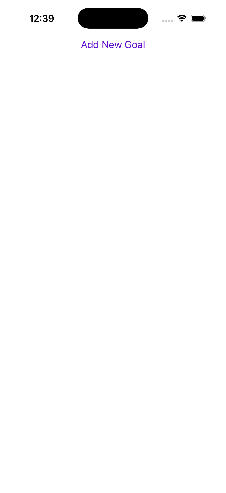
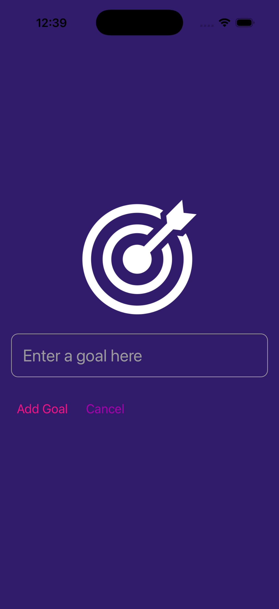
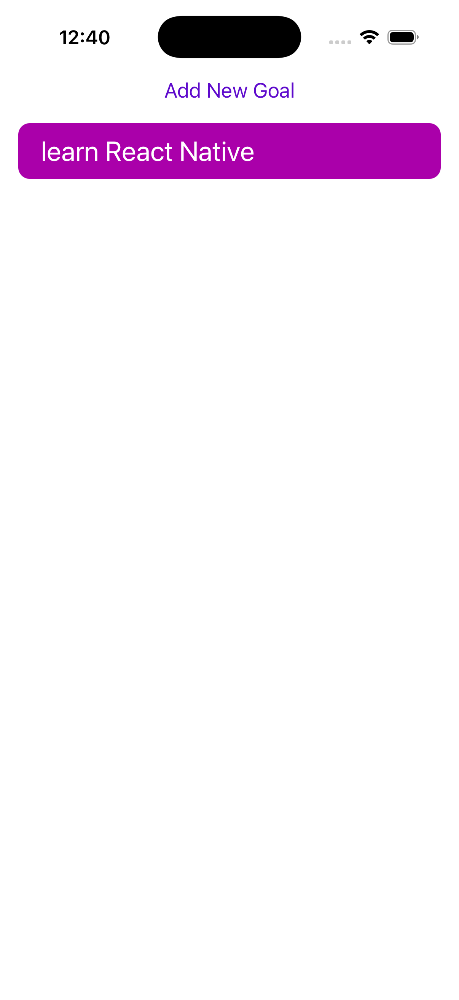

# Goal List

A clean, minimal mobile app for tracking personal goals. Goal List provides a simple interface to capture short-term and long-term goals, review them at a glance, and remove goals that you've completed or no longer want to pursue.

## Features

- Quickly add a new goal with a short title or sentence.
- View all active goals in a scrollable list.
- Remove goals you no longer need (for example, when completed).

## User flow

1. Open the app to see the list of existing goals (empty on first launch).
2. Tap the "Add Goal" control to open the input UI.
3. Enter a short title for your goal and confirm to add it to the list.
4. Tap a goal to remove it from the list.
5. Repeat as you add, review, and clear goals over time.

## Screenshots

<div align="center">
  
  
  
</div>

## Installation

This project is a JavaScript-based React Native app and can be run with Expo.

1. Prerequisites

   - Node.js (LTS recommended)
   - npm or Yarn
   - Expo CLI (optional but recommended): `npm install -g expo-cli` or use `npx expo`

2. Clone and install

   ```bash
   git clone https://github.com/andrei1sirbu/goal-list-mobile-app.git
   cd goal-list-mobile-app
   npm install
   # or
   yarn
   ```

3. Start the development server

   ```bash
   npx expo start
   # or
   npm start
   ```

4. Run on a device or simulator
   - Use the Expo Go app on iOS/Android and scan the QR code shown by the dev server.
   - Or run on a simulator:
     - Android: `npx expo run:android`
     - iOS (macOS + Xcode): `npx expo run:ios`

If the project is not using Expo in your local copy, use the standard React Native CLI commands:

```bash
npx react-native run-android
npx react-native run-ios
```

## Tech stack

- JavaScript (ES6+)
- React Native
- Expo (project configuration provided)

## Project structure

- App.js — main application component and root UI
- index.js — entrypoint used by the bundler
- app.json — Expo configuration
- components/ — reusable UI components (inputs, list items, modals)
- assets/ — images and static assets
- package.json / package-lock.json — dependencies and scripts
